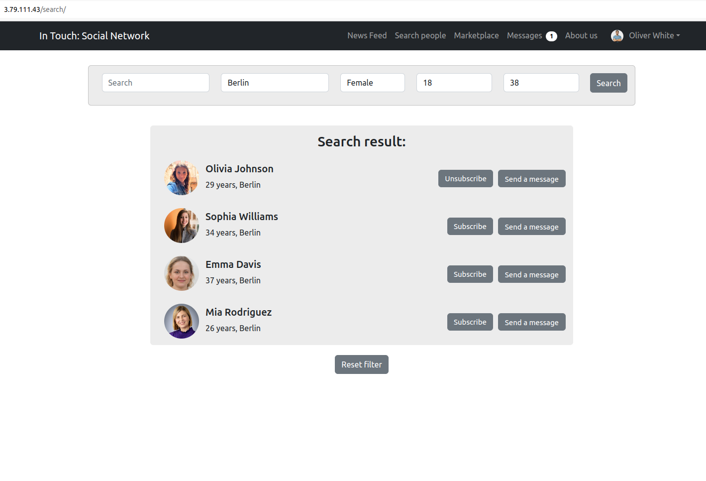
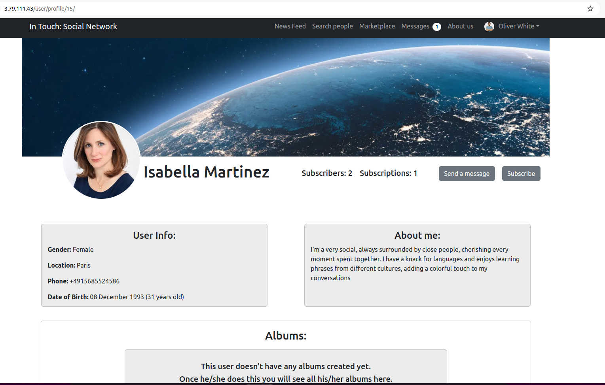

# social_network

## Group project  
  
**Team members:**  Maksym Kharchenko, Rituparna Dobey, Jonathan Lemarie, Jaime Olivos  
  
**Project name:** “In touch”  
  
**Description:** Social network with marketplace function. Here people can share their thoughts and life events. 
Also, each user can create an advertisement for the sale (or give away for free) some of their things that they no longer need.  
  
### Features and Updates:  
- Implemented the system where in the news feed we can see only posts from our subscriptions
- Created tests for "Feed" app
- Created design for messaging templates 
- Added "Subscribe" and "Send a message" buttons on the Search page
- Implemented Messaging system + notification of new message
- Implemented Subscription system
- Finished User profile page
- Search system on Search page implemented
- Search page finished
- Created demo version of User profile page
- Created demo version of Marketplace page
- Created "News feed" page
- Implemented Like button
- Implemented Comments for every post
  
### How it looks like (first steps):  
  
   
  
#### Like button and comments (demo version)
  
   
  
### "Search people" page:  
  
   
  
### How search system works:
  
 
  
### User profile page:
  
 
  
### Messages system. Page with all Chats:  
  
 
  
### Messages system. Page "Chat with another user":  
  
 
  
