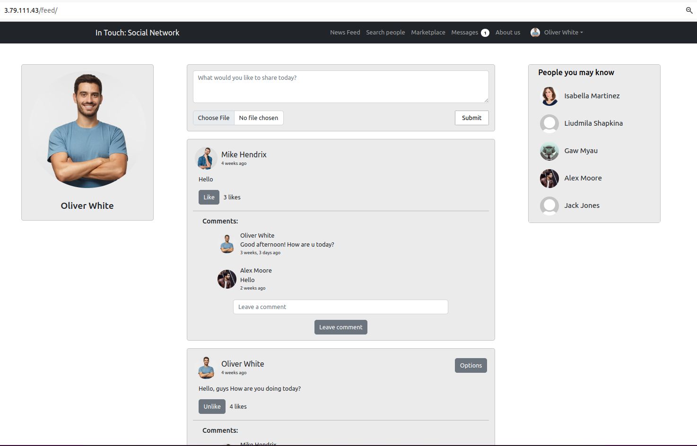
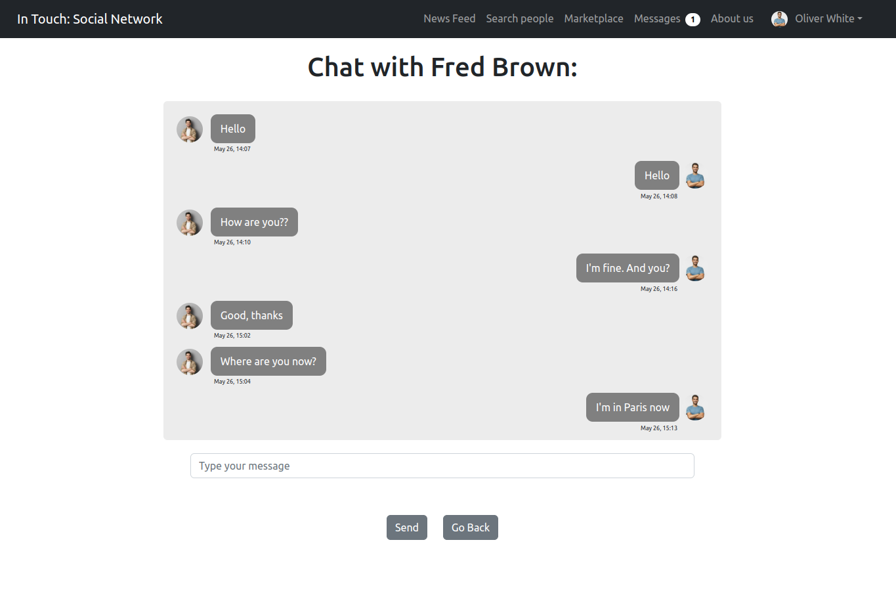

# In touch: social network
  
### What is "In touch":  
  

  
### What were implemented:  
  

  
### OUR TEAM:  
  

  
  
### Features and Updates:  
- Implemented CI/CD using aws CodePipeline
- Deployed on aws using ec2, rds and s3
- Finished design of the whole website
- Finished Marketplace
- Implemented Albums
- Implemented search system for "dummy users" from API.  
For example if we want to find people from Berlin except real users we will see dummy users also (if api is working)
- Implemented API into the program code. When we go to the "Search" page, we have 78 dummy users now
- Created API with token authentication level
- Implemented recommendation section on the templates for users who don't have subscriptions
- Implemented recommendation system based on users who have sme posts
- Implemented the system where in the news feed we can see only posts from our subscriptions
- Created tests for "Feed" app
- Created design for messaging templates 
- Added "Subscribe" and "Send a message" buttons on the Search page
- Implemented Messaging system + notification of new message
- Implemented Subscription system
- Finished User profile page
- Search system on Search page implemented
- Search page finished
- Created demo version of User profile page
- Created demo version of Marketplace page
- Created "News feed" page
- Implemented Like button
- Implemented Comments for every post
  
## How it looks like:  
  
   
  
### News feed:
  
   
  
#### Like button and comments
  
   
  
### "Search people" page:  
  
   
  
### How search system works:
  
 
  
### User profile page:
  
 

  
### Messages system. Page with all Chats:  
  
 
  
### Messages system. Page "Chat with another user":  
  
 
  

